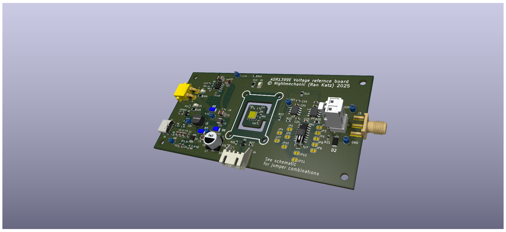

# ADR1399E Voltage reference circuit

This is a **hobby grade** 10V (well, close to...) voltage refernce based on Analog Devices' ADR1399E reference.
It can be powered with either 5V USB (using a boost switching regulator) , or a 5S Li-Ion pack (or equivalent)

*(Kicad rendering of the board)*

## Source:
Mostly based on: https://www.eevblog.com/forum/metrology/lm399-based-10-v-reference/ (specifically replies starting from 1300 to about 1343)

## Notes:
Designed in KiCad (9.0)

### Enclosure:
3D printable 2-piece enclosure design in [onshape](https://cad.onshape.com/documents/444727e948f9e5cc4e41eae1/w/781dc2eb3e355c2d7b923edf/e/b0f13c680a3e4fdfcef48c95?renderMode=0&rightPanel=namedPositionPanel&uiState=685cefcc24538942f7012c4b)

- Designed to use (4) M3x5x4 ("Voron") threaded inserts and (4) m3x20 screws for securing the base and lid together 
- With 4mm and 2mm Banana socket pairs
- With an (optional) internal refernce covers (identical top and bottom), to, somewhat, thermally isolate the refernce "island" from the rest 

Note that top/lid 3D printing may require supports for the screw head recesses
Printing the internal refernce cover will need supports
